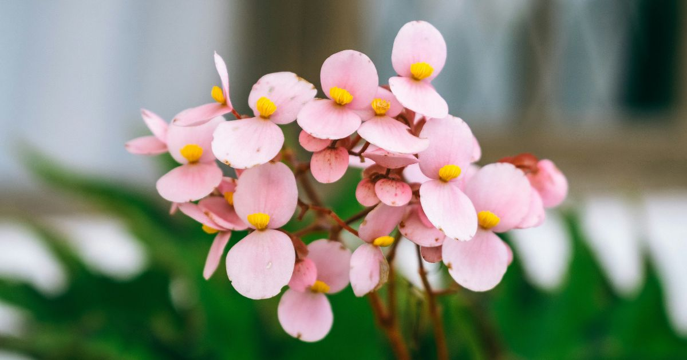
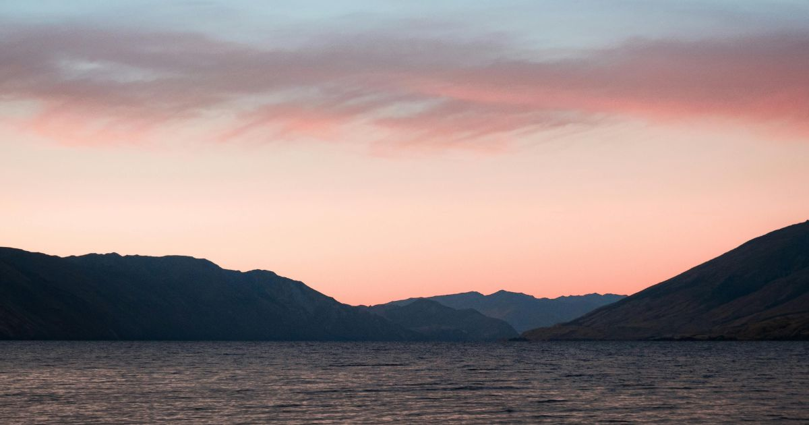
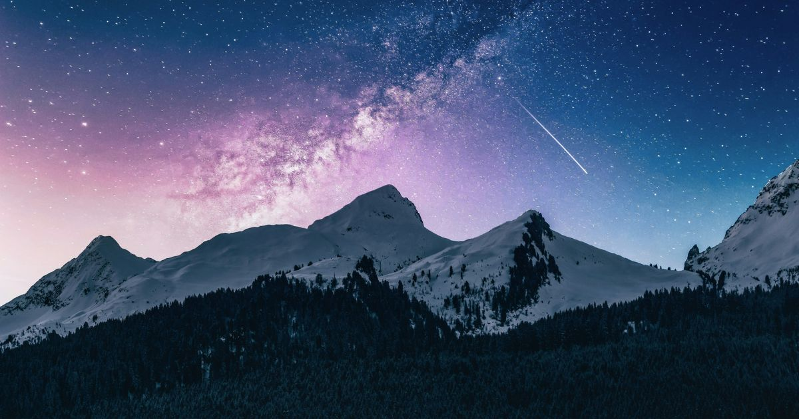

+++
title = "Begônias, aquarelas e as estrelas do nosso amor"
date = "2025-02-17"
lastmod = "2025-04-29"
tags = ["poesia"]
url = "/begonias-aquarelas-e-as-estrelas-do-nosso-amor/"
description = "Um texto sobre amor, saudade e transformações. Reflexões sobre o brilho das estrelas, a suavidade das aquarelas e a doçura de um encontro que mudou tudo."
images = ["paisagem_pastel.jpg"]
author = "Breno Santana"
+++

## Um abrigo quentinho para meu coração

Há exatamente um mês, tive a imensurável sorte de me reencontrar com alguém que transformaria a minha vida por completo.

A partir desse dia, tudo se transformou, e passei a sentir um crescimento constante e gentil, semelhante à uma planta que floresce ao ser regada a cada novo amanhecer.

Como num passe de mágica, ela juntou os pedaços partidos do meu coração, cuidando de cada um deles — até que se recuperassem e retornassem curados ao seu devido lugar.

Logo, experienciei uma série de jornadas incríveis e inesquecíveis, em uma sequência surreal, que me revelaram um vislumbre de como quero viver o restante da minha história.

Toda a tristeza que sufocava minha alma por tanto tempo se dissolveu no abraço de um amor incondicional, aquecido pelo toque sincero e gentil do carinho mais puro e recíproco que alguém poderia oferecer, como se fosse fácil.

Percebemos quase de imediato que precisávamos um do outro, não apenas por um instante fugaz, mas por todo o tempo que ainda nos restava — aquele que antes, tanto nos assombrava.

## Amor e saudades com perfume de flores

Ela me lembra das begônias rosas, com seus detalhes lindos, doces e carismáticos. Seu jeitinho meigo e delicado encanta e hipnotiza, como uma dança suave em câmera lenta.

Quando fala ou canta, me perco em suas palavras e melodias, que me deixam em sintonia com sua voz aconchegante, e flutuo leve sob as estrelas mais brilhantes. Ela é genial, uma poeta, uma artista. Sou seu fã número um, perdidamente encantado por cada gesto, verso e sincronia.

O tempo parece viajar na velocidade da luz, em um passo impiedoso e inconsistente. Todo segundo é mais do que valioso, e cada batimento de nossos corações conta uma história diferente.

É maravilhoso como ela transforma o simples no extraordinário, me guiando através de seus olhos castanhos-escuros hipnotizantes, revelando o fascínio dos pequenos detalhes ao nosso redor.

Fato é que temos disposição para desvendar os segredos do mundo e viver intensamente cada capítulo da nossa história. Pois, a cada página escrita juntos, encontramos uma aventura inédita e ainda mais surpreendente.

Estamos profundamente conectados pela arte, influenciados pela música, pela literatura, pela natureza e pelo vasto universo que se estende infinitamente acima de nossas cabeças.

## Paisagens coloridas, singelas e serenas

O meu mundo mudou de cor — o que antes era preto e branco, agora se tornou a aquarela mais vibrante e inspiradora de todas, onde cada tom reflete a essência do meu novo eu.

Nossa paleta de cores favorita é a pastel, com suas cores tão suaves e delicadas. Trazendo à tona a beleza serena dos nossos pensamentos gentis e sentimentos mais profundos.

Seu abraço é o porto seguro onde sempre encontro abrigo, o sinônimo mais perfeito de calmaria e paz. Sua presença é um refúgio tranquilo e aconchegante, como uma cabana acolhedora em meio à tempestade.

Conto ansiosamente os dias, as horas, os minutos e os segundos para voltar e poder reencontrá-la, pois a saudade aperta meu peito ferozmente. O relógio é um inimigo cruel, que insiste injustamente em prolongar a distância entre nós.

Cuidar dela tornou-se meu propósito, pois, em sua felicidade encontro a minha. A razão para os meus passos está em celebrar suas conquistas, que também são uma parte crucial de mim. E juntos vamos colecionando vitórias e sorrisos.

A gente se entende tão bem, como se tivéssemos experienciado incontáveis vidas no passado. E não há dúvidas ou mistérios no fim — até o último suspiro, estaremos lado a lado.

## Do pináculo, contemplo teu brilho celestial

Cada estrela cintila com mais vida quando penso nela, como se o próprio cosmo conspirasse, tomado por inspiração, para nos unir.

Tenho certeza de que as estrelas se alinham perfeitamente para nós. Pois, quando observo calmamente o céu, percebo que sua imensidão nem se compara ao tamanho do nosso amor.

Os sinais evidentes atravessam todas as realidades e dimensões, cruzando o tempo, o espaço e o próprio universo, sempre nos guiando de volta um ao outro, em todas as circunstâncias, realidades possíveis e impossíveis que transformamos constantemente.

Ela me inspira imensamente, assim como os misteriosos planetas cativam os astrólogos. Quero explorar todos os seus segredos e desvendar as constelações que formam os caminhos que levam até o seu coração.

À ti, meu amor, gratidão eterna por me proporcionar os melhores trinta e um dias da minha vida. Não há palavras que possam acompanhar o ritmo desse amor etéreo.

Uma cartinha digital para a minha menina de coração dourado. Eu te amo, Maria Eduarda.