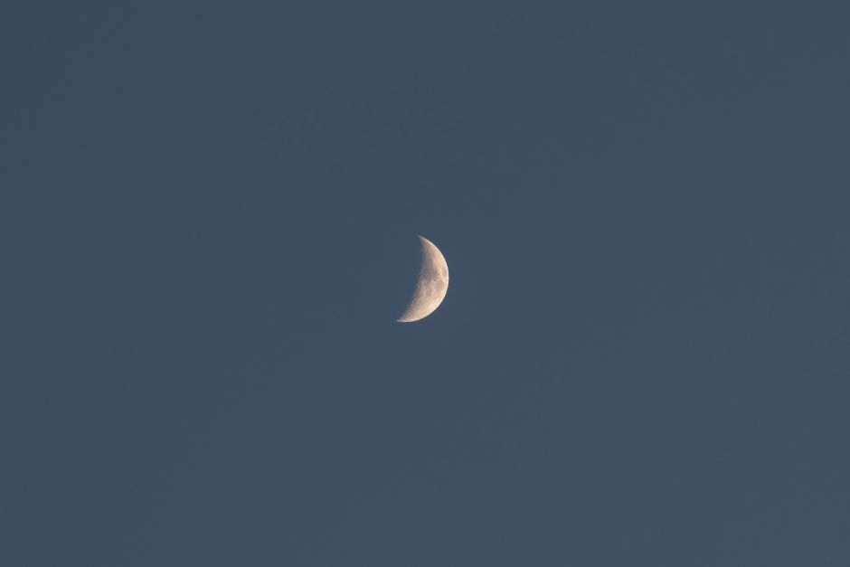

+++
title = "Hiperfoco, minimalismo e meu jardim inspirador"
date = "2025-05-01"
lastmod = "2025-05-02"
tags = ["tecnologia"]
url = "/hiperfoco-minimalismo-e-meu-jardim-inspirador/"
description = "Uma reflexão sobre a criação de um blog minimalista e inspirador, onde simplicidade e afeto se entrelaçam para cultivar um ambiente digital com propósito e autenticidade."
images = ["/thumbnails/folha_minimalista.jpg"]
author = "Breno Santana"
sharing_image_alt = "Uma única folha verde escura, de formato característico e com nervuras visíveis, com seu caule fino e longo, isolada contra um fundo totalmente branco."
+++

## Tecendo meu quadro de ponderações

Os últimos três dias foram intensos — sessões exaustivas com muito tempo de tela, linhas de código infinitas e incontáveis xícaras de café.

Havia iniciado minha jornada em busca de um blog independente, que pudesse refletir precisamente meus conceitos e princípios.

Não foi uma tarefa fácil, mas o resultado é a realização de um sonho e o primeiro passo para focar no mais importante: escrever.

Na minha visão, os três pilares fundamentais para a estrutura de um espaço digital são: conforto, desempenho e privacidade.

E, modéstia à parte, este projeto cumpre cada um deles com precisão —  foi uma escolha consciente.

Meu perfeccionismo ora me guia, ora me detém, mas definitivamente nunca passa despercebido.

## O refúgio do jardim da simplicidade

Sou fascinado pelo minimalismo — não apenas como estética, mas também como uma filosofia de desenvolvimento pessoal.

Aprendi na prática que a chave para silenciar as distrações é priorizar o essencial, com praticidade e funcionalidade na medida certa.

Simplicidade traz clareza, e ela permite que a mensagem seja recebida com eficácia e solidez.

Tenho em mente um cenário hipotético: leve, acolhedor, que envolve e convida a refletir, sem pressa para encontrar as respostas.

Penso nele como um lar — um abrigo para os meus pensamentos, que merecem ficar.

É meu jardim, que precisa ser cultivado com ternura, propósito e constância.

## Quero inspirar, como sou inspirado 

Me fascina como as experiências individuais moldam personalidades, resultando em expressões singulares e repletas de vida.

O que compartilho é um pedaço de mim — um fragmento que talvez se conecte ao seu, mas que, especialmente, carrega minha essência.

Não construí este espaço por acaso — ele nasceu das pequenas coisas que me tocam e, com o tempo, se transformam em algo maior: uma metamorfose de ideais.

O código-fonte deste projeto está em domínio público, porque acredito que toda voz que deseja se expressar merece ser ouvida.

Se o meu jardim sereno te acolhe, então ele também te pertence — pois nasceu e cresceu de um mosaico de reflexões coletivas.

> Tu te tornas eternamente responsável por aquilo que cativas.[^1]

A medida que as ideias florescem, nutridas pelo cuidado constante, o cenário revelará a essência da sua autêntica identidade.

[^1]: Antoine de Saint-Exupéry, "O Pequeno Príncipe", 1943.