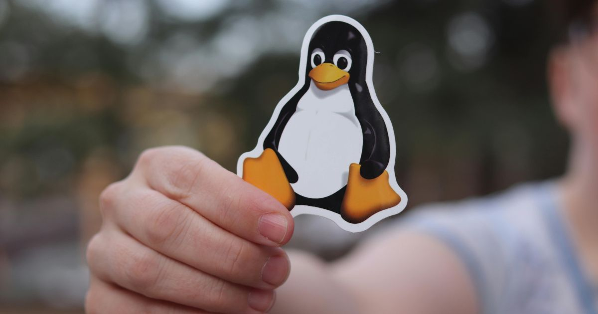

+++
title = "Pinguins são muito mais interessantes do que janelas"
date = "2025-04-04"
lastmod = "2025-04-29"
tags = ["tecnologia"]
url = "/pinguins-sao-muito-mais-interessantes-do-que-janelas/"
description = "Pinguins são criaturinhas fascinantes — e, no mundo da tecnologia, eles deslizam para muito além do gelo. Do seu computador ao planeta Marte, o Linux está em todos os lugares, enquanto as janelas… bem, nem sempre são a melhor opção."
images = ["/thumbnails/pinguim_banhando_na_antartica.jpg"]
author = "Breno Santana"
sharing_image_alt = "Pinguim mergulha na água entre icebergs brancos com detalhes azuis. A cena transmite ação e frio no ambiente antártico."
+++

## Era uma vez um pinguim carismático...

Sempre achei os pinguins adoráveis e interessantes, mas minha admiração ficou ainda maior graças ao Linux e seu icônico mascote.

Tux é um pinguim rechonchudo que esbanja charme e elegância, um ícone clássico reconhecido por qualquer amante de tecnologia.

E, já para deixar claro, eu não viveria sem janelas. Elas são indispensáveis, especialmente porque eu moro em um lugar muito quente.

Minha produtividade ao usar sistemas baseados em Linux é inquestionavelmente melhor — tudo flui com perfeição, velocidade e eficiência.

GNOME é minha interface gráfica favorita. Ela tem personalidade, e seu design minimalista é exatamente o que preciso no meu dia a dia.

A função de espaços de trabalho virtuais é impecável. Em segundos, organizo minhas janelas, alterno entre tarefas e mantenho meu fluxo de trabalho ágil e sem distrações.

## Pinguins são limpos, janelas nem sempre

Meu computador sente-se acolhido — mesmo que com um leve odor de aves marinhas. E, embora ele não possa literalmente voar, assim como os pinguins, metaforicamente, a performance faz minha máquina decolar.

Enquanto isso, no Windows, apesar do nome, janelas são a última coisa que consigo usufruir. Tecnicamente, o Linux gerencia os recursos do sistema de forma mais eficiente e minhas memórias RAM tiram férias na Antártica.

Pinguins são animais limpinhos e higiênicos. Eles passam muito tempo se cuidando — alisando as penas com o bico e tomando banhos regularmente no oceano gelado.

Janelas precisam de cuidado, e quando acumulam poeira, podem se tornar um grande problema — principalmente para alguém como eu, que sofre com alergias intensas.

E o acúmulo de processos desnecessários em segundo plano, serviços de telemetria invasivos e softwares que absolutamente ninguém pediu, com certeza, tornam essas janelas imundas.

Eu só quero um sistema enxuto, que priorize o essencial e coloque o usuário final no centro da experiência — que permaneça limpo, leve e eficaz, sem precisar de faxinas constantes.

## Perdido em marte com pinguins

Sabe o que é ainda melhor do que pinguins comuns que você encontra no Hemisfério Sul?

Pinguins blindados, robustos como tanques de guerra, operando em servidores colossais — de gigantes corporativos a agências espaciais.

Existem pinguins bem remunerados trabalhando nos bastidores dos servidores que hospedam os sites e serviços que você consome, no roteador que direciona sua conexão ou até no sistema operacional do seu celular Android.

E se isso já te parece impressionante, saiba que eles foram além — para onde nenhum humano jamais pisou (pelo menos por enquanto).

O helicóptero Ingenuity, que voa sobre o solo marciano ao lado do rover Perseverance, opera com um sistema baseado em Linux.[^1]

Em meio ao frio extremo e à atmosfera rarefeita de Marte, lá estão eles, provando que pinguins podem sim voar — pelo menos no espaço.

[^1]: Bijan Stephen, ["Linux has made it to Mars"](https://www.theverge.com/2021/2/19/22291324/linux-perseverance-mars-curiosity-ingenuity) The Verge, 19 de fevereiro de 2021.