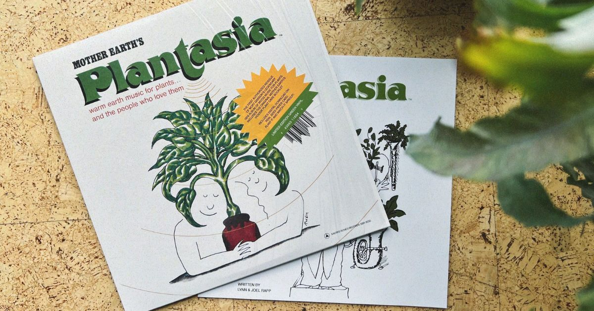
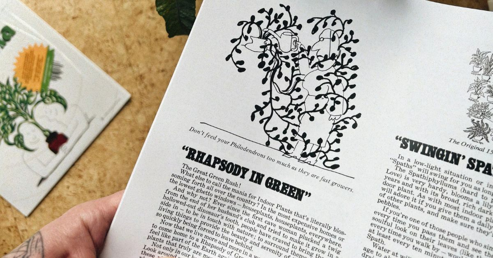

+++
title = "Plantasia encanta com sua filosofia e misticismo"
date = "2025-01-31T13:06:11-03:00"
tags = ["musica"]
url = "/blog/plantasia-encanta-com-sua-filosofia-e-misticismo/"
description = "Plantasia é um disco de 1976 criado para plantas e aqueles que às amam, misturando sintetizadores, misticismo e uma conexão única e aconchegante com a natureza."
images = ["arte_do_plantasia.jpg"]
author = "Breno Santana"
+++

## O presente perfeito para as suas plantas

Plantasia é um daqueles discos que encantam antes mesmo da primeira nota, criado especialmente para ser apreciado por plantas domésticas e por aqueles que as amam.

Seu conceito único nasceu do crescente fascínio pelo comportamento das plantas no início dos anos 70, influenciado por pesquisas que sugeriam intrigantes reações à música.

Mort Garson foi um dos pioneiros da música eletrônica e do extraordinário sintetizador Moog, criando algumas das atmosferas mais impressionantes e místicas da história.

A distribuição deste disco em 1976 tem uma história curiosa — e, como não poderia ser diferente, tem tudo a ver com plantas.

Na Los Angeles da época, mais precisamente na Avenida Melrose, havia uma encantadora floricultura chamada Mother Earth's Plant Boutique, administrada por Joel Rapp e Lynn.

Os clientes sortudos que buscavam por plantas domésticas tiveram o prazer de levar para casa brindes exclusivos: um guia completo de cuidados, especialmente elaborado pelos proprietários, e, como cereja do bolo, o recém-lançado vinil de Plantasia.

## Natureza portátil para os seus ouvidos

As pesquisas sobre os efeitos da música nas plantas ainda geram debates e seguem sem conclusões definitivas.

No entanto, isso em nada desvaloriza a qualidade extraordinária da obra. As músicas vão além do hipnotizante, conduzindo você a uma espécie de fotossíntese sonora.

A introdução do disco é um grande espetáculo, e o desenrolar das faixas é místico, etéreo e futurista. Criando uma conexão profunda com a natureza, onde quer que você esteja.

As composições prestam homenagem a diversas plantas domésticas populares, como a clorofito, violeta-africana, begônia, filodendro, lírio-da-paz, samambaia e espada-de-são-jorge, por meio de concertos eletrizantes e melodias sintetizadas.

Cada faixa possui sua própria identidade única, assim como as plantas. No entanto, todas compartilham da mesma atmosfera surreal e transcendente, reproduzida de forma inconfundível pelo sintetizador Moog.

Ou talvez isso se deva ao fato de Mort Garson ter sido um ocultista — quem sabe ele conhecia segredos que nós, meros humanos, ainda não somos capazes de compreender.

## Enraizados entre notas musicais

Plantasia tornou-se um clássico cult da música eletrônica, influenciando diversos artistas e gêneros, como a música ambiente, terapêutica e experimental contemporânea.

O disco foi relançado em junho de 2019, pela gravadora independente Sacred Bones Records, ressuscitando quase meio século depois, a sua poética mensagem de valorização ambiental (e culto ao Moog).

Não posso negar que sonho com um futuro em que as plantas possam falar e, com muita gentileza, nos peçam para tocar esse disco para acalmá-las durante o frio do inverno.

Permita-se vivenciar o misticismo de Plantasia em uma jornada leve, acolhedora e serena, envolta pelo aroma das folhas verdes e pelo som suave de um riacho ou da chuva.

Não deixe de regar as suas plantas domésticas e alimentá-las com paciência e amor, permitindo que elas floresçam ao ritmo da mística natural que nos cerca invisivelmente.

Enquanto nós, ansiosos, corremos contra o relógio da vida, buscando um futuro incerto, as plantas crescem em silêncio, enraizadas na terra e alimentadas pela água e a luz.